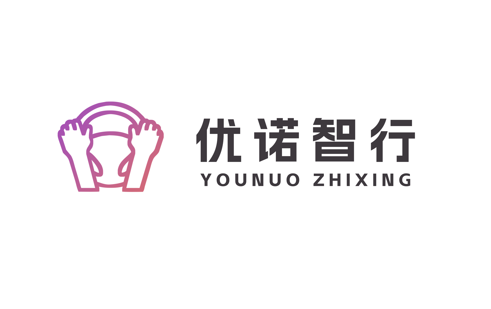

  
  
<em>让每一台机器，感知环境 · 自主决策 · 独立行动</em>

---

## 📍 关于我们

总部 base 苏州，专注于**具身机器人**领域的技术研发与工程落地。

我们致力于：
- 🔭 探索前沿技术，在实践中成长
- 🌱 分享知识经验，赋能每一位成员
- 🤝 开放协作，让代码更有温度

目前在**导航控制**、**操作控制**等方向持续深耕，推动机器人从实验室走向真实场景。

## 👥 核心成员

| 成员 | 角色 | 领域 |
| :--- | :--- | :--- |
| [@unomove](https://github.com/unomove) | 核心开发者 / 组织者 | AI / 机器人 |
|  | 核心开发者 | xx / xxx |

## 📌 当前进行中

| 项目 | 简介 |
| :--- | :--- |
| [项目名] | 简短描述 |
| [项目名] | 简短描述 |

## 📫 联系我们

- 💬 GitHub Issues：用于技术讨论和项目反馈
- 📧 邮箱：`contact@unomove.com`
- 🌐 官网：*www.younuozhixing.com*

**如果你对具身机器人、导航/操作控制感兴趣，欢迎关注我们，或直接与我们取得联系。**

---

⭐ *关注优诺智行，一起推动具身智能走向现实*

## 📊 组织统计

## 📊 组织统计

  
  
  
  
  
  
  

